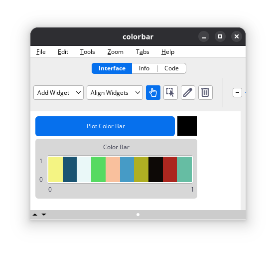

# ColorBar

<!-- badges: start -->
[](https://www.repostatus.org/#inactive)
[](http://creativecommons.org/publicdomain/zero/1.0/)
<!-- badges: end -->

## Overview

This repository contains a [NetLogo](https://www.netlogo.org) model that demonstrates how to create a simple color bar plot.

Since NetLogo does not currently include a built-in color bar widget, this model offers a workaround by drawing one with temporary plot pens.

For another example of implementing a color bar in NetLogo, see the [`LogoClim`](https://github.com/sustentarea/logoclim) model.

<p align="center">
  
</p>

## How It Works

The color bar can be drawn in any plot using the `plot-color-bar` procedure. This procedure takes the plot name as an argument and creates a random color bar with 10 different colors. The implementation can be adapted to fulfill specific requirements.

```netlogo
to plot-color-bar [#plot-name]
  set-current-plot #plot-name
  clear-plot
  set-plot-x-range 0 1
  set-plot-y-range 0 1

  let #pen (range 1 11)
  let #pen-length length #pen
  let #pen-interval 1 / #pen-length
  let #pen-color n-values #pen-length [random-float 100]

  let #pen-range map [
    #i -> (list ((#i - 1) / #pen-length) (#i / #pen-length))
  ] #pen

  let #line-step-size 0.01
  let #line-step 0

  (foreach #pen #pen-color #pen-range [
    [#i #j #k] ->
      create-temporary-plot-pen (word #i "-bar")
      set-plot-pen-mode 1
      set-plot-pen-interval #pen-interval
      set-plot-pen-color #j
      plotxy (first #k)  1

      create-temporary-plot-pen (word #i "-line")
      set-plot-pen-mode 0
      set-plot-pen-interval #pen-interval
      set-plot-pen-color #j

      while [#line-step < 1] [
        plotxy (first #k) #line-step
        plotxy (last #k) #line-step

        set #line-step #line-step + #line-step-size
      ]

      set #line-step 0
  ]
end
```

## How to Use It

Ensure you have [NetLogo](https://www.netlogo.org) installed. This model was developed using NetLogo 7.0.0, so it is recommended to use this version or later.

Once everything is set, open the `colorbar.nlogox` file located in the `nlogox` folder and click on the *Plot Color Bar* button to visualize the color bar.

## License

[](http://creativecommons.org/publicdomain/zero/1.0/)

The code is licensed under the [Creative Commons CC0 1.0 Universal License](https://creativecommons.org/publicdomain/zero/1.0/). This means that you can copy, modify, distribute and perform the work, even for commercial purposes, all without asking permission.
