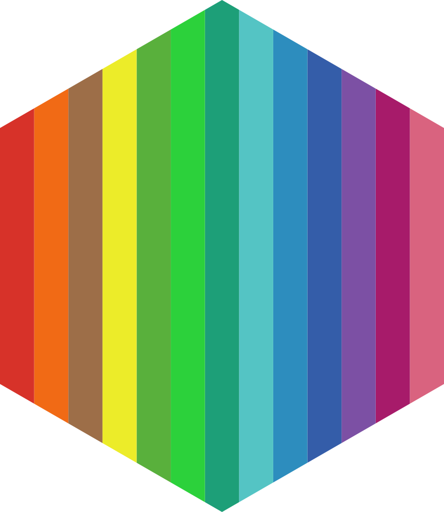
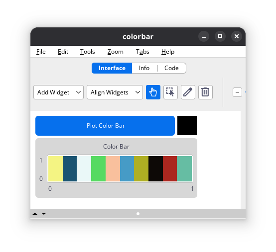
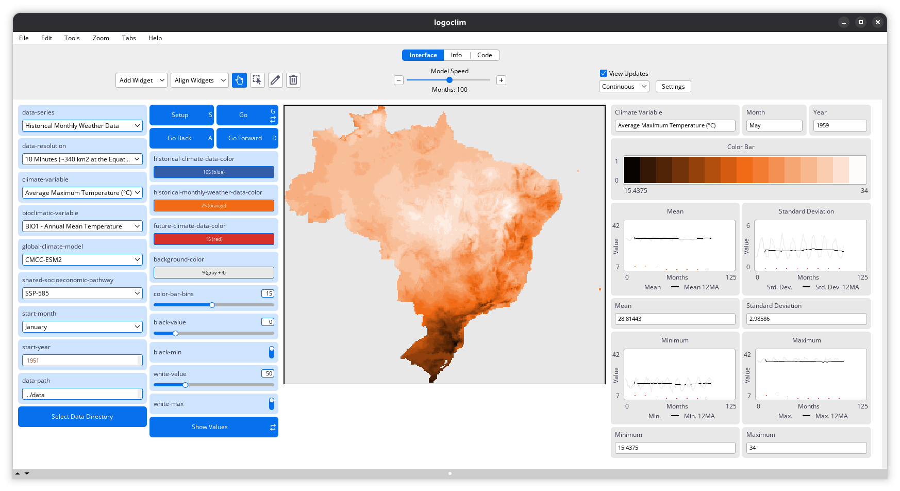

# ColorBar <a href = "https://github.com/danielvartan/logoshapes"></a>

<!-- badges: start -->
[](https://www.repostatus.org/#active)
[](https://danielvartan.github.io/colorbar/)
[](https://doi.org/10.5281/zenodo.18120463)
[](https://fairsoftwarechecklist.net/v0.2?f=21&a=32113&i=02211&r=123)
[](https://fair-software.eu)
[](https://www.gnu.org/licenses/gpl-3.0)
[](https://www.contributor-covenant.org/version/3/0/code_of_conduct/)
<!-- badges: end -->

## Overview

`ColorBar` is a [NetLogo](https://www.netlogo.org) model demonstrating how to create a simple color bar plot. Since NetLogo does not include a built-in color bar widget, this model provides a workaround by drawing one using temporary plot pens.

Click [here](https://danielvartan.github.io/colorbar/) to see this model online on [NetLogo Web](https://www.netlogoweb.org)!

A [NetLogo extension](https://github.com/NetLogo/NetLogo/issues/2559#issuecomment-3334999283) may be developed in the future to simplify color bar creation. For now, this model serves as a practical example.

<p align="center">
  
</p>

For another color bar implementation in NetLogo, see the [`LogoClim`](https://github.com/sustentarea/logoclim) model.

<p align="center">
  
</p>

## How It Works

The color bar can be drawn in any plot using the `plot-color-bar` procedure. This procedure takes the plot name as an argument and creates a random color bar with 10 different colors. The implementation can be adapted to fulfill specific requirements.

```netlogo
to plot-color-bar [#plot-name]
  set-current-plot #plot-name
  clear-plot
  set-plot-x-range 0 1
  set-plot-y-range 0 1

  let #pen (range 1 11)
  let #pen-length length #pen
  let #pen-interval 1 / #pen-length
  let #pen-color n-values #pen-length [random-float 100]

  let #pen-range map [
    #i -> (list ((#i - 1) / #pen-length) (#i / #pen-length))
  ] #pen

  let #line-step-size 0.01
  let #line-step 0

  (foreach #pen #pen-color #pen-range [
    [#i #j #k] ->
      create-temporary-plot-pen (word #i)
      set-plot-pen-interval #pen-interval
      set-plot-pen-color #j

      while [#line-step < 1] [
        plotxy (first #k) #line-step
        plotxy (last #k) #line-step

        set #line-step #line-step + #line-step-size
      ]

      set #line-step 0
  ])
end
```

## How to Use It

### Setup

To get started, ensure you have [NetLogo](https://www.netlogo.org) installed. This model was developed using NetLogo 7.0.3, so it is recommended to use this version or later.

### Downloading the Model

You can download the latest release of the model from its [GitHub
Releases page](https://github.com/danielvartan/colorbar/releases/latest).
For the development version, you can clone or download its [GitHub
repository](https://github.com/danielvartan/colorbar/) directly.

### Running the Model

Once everything is set, open the `colorbar.nlogox` file located in the
`nlogox` folder to start exploring!

Refer to the `Info` tab in the model for additional details.

## How to Contribute

[](https://www.contributor-covenant.org/version/3/0/code_of_conduct/)

Contributions are always welcome! Whether you want to report bugs, suggest new features, or help improve the code or documentation, your input makes a difference.

Before opening a new issue, please check the [issues tab](https://github.com/danielvartan/colorbar/issues) to see if your topic has already been reported.

## License

[](https://www.gnu.org/licenses/gpl-3.0)

```text
Copyright (C) 2025 Daniel Vartanian

ColorBar is free software: you can redistribute it and/or modify it under
the terms of the GNU General Public License as published by the Free Software
Foundation, either version 3 of the License, or (at your option) any later
version.

This program is distributed in the hope that it will be useful, but WITHOUT ANY
WARRANTY; without even the implied warranty of MERCHANTABILITY or FITNESS FOR A
PARTICULAR PURPOSE. See the GNU General Public License for more details.

You should have received a copy of the GNU General Public License along with
this program. If not, see <https://www.gnu.org/licenses/>.
```
